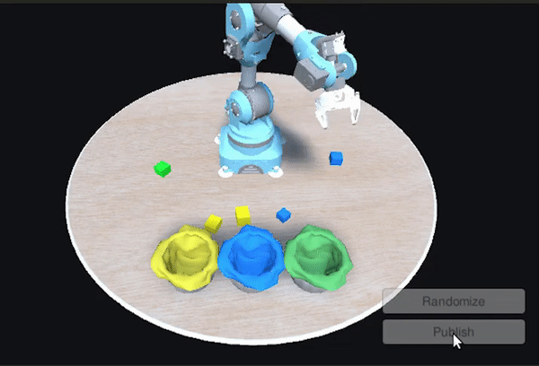
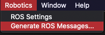

<p align="center"></p>

# Zabot: Robotic Garbage Sorter

> Note: This project has been tested with Python 3 and ROS Noetic.

## What is it about?

This project aims to develop the logic and control necessary for a robotic arm, so that it is capable of detecting, collecting and classifying garbage from its environment. It has 3 branches:
    
   - `master` branch: Cube type object sorter in a Unity simulation environment.
   - `real_garbage` branch: Garbage sorter in a Unity simulation environment. 
   - `real_world` branch: Object sorter in a real environment. It is capable of detecting complex objets, but the classification is made by their color.
    
> Note: This Readme explains the project in the `real_garbage` branch. If you are interested in the other projects, switch to the desired branch.

This project was created thanks to and starting from these 2 Unity-Technologies tutorials:

  - Pick-and-Place tutorial: https://github.com/Unity-Technologies/Unity-Robotics-Hub/tree/main/tutorials/pick_and_place
  - Object Pose Estimation demo: https://github.com/Unity-Technologies/Robotics-Object-Pose-Estimation

## Requirements

  - Unity Hub
  - Unity Editor version 2020.3.11f1 (LTS)
  - ROS Noetic
  - Python 3
  - The following packages:
    ```bash
        sudo apt-get update && sudo apt-get upgrade
        sudo apt-get install python3-pip ros-noetic-robot-state-publisher ros-noetic-moveit ros-noetic-rosbridge-suite ros-noetic-joy ros-noetic-ros-control ros-noetic-ros-controllers ros-noetic-tf* ros-noetic-gazebo-ros-pkgs ros-noetic-joint-state-publisher
        sudo pip3 install rospkg numpy jsonpickle scipy easydict torch==1.7.1+cu101 torchvision==0.8.2+cu101 torchaudio==0.7.2 -f https://download.pytorch.org/whl/torch_stable.html
      ```

    > Note: If you encounter errors installing Pytorch via the above `pip3` command, try the following instead:
    > ```bash
    > sudo pip3 install rospkg numpy jsonpickle scipy easydict torch==1.7.1 torchvision==0.8.2 torchaudio==0.7.2 -f https://download.pytorch.org/whl/torch_stable.html
    > ```
  
## How to try it?

1. Clone the repository.
2. Load `PickAndPlaceProject/` folder in Unity Hub.
3. Open the loaded project.
4. Next, the ROS TCP connection needs to be created. Select `Robotics -> ROS Settings` from the top menu bar.

   In the ROS Settings window, the `ROS IP Address` should be the IP address of your ROS machine.

   - Find the IP address of your ROS machine. In Ubuntu, open a terminal window, and enter `hostname -I`.
5. Select `Robotics -> Generate ROS Messages...` from the top menu bar.

   

   In the ROS Message Browser window, click `Browse` next to the ROS message path. Navigate to and select the ROS directory of this cloned repository. This window will populate with all msg and srv files found in this directory.

6. Go to https://www.dropbox.com/sh/i4ymvbv1k4jel83/AAAvNKmJ5uzqyKQza3c2NXvCa?dl=0 and download the desired trained models. The `master` branch (cube sorter) works with the following 2 models:
    - Niryo_1by1_model_class_ep64.tar
    - Niryo_1by1_model_translation_ep52.tar

   On the other hand, `real_garbage` branch (garbage sorter) works with the following 2 models (although they do not perform quite well):
    - Niryo_RealGarbage_model_class.tar
    - Niryo_RealGarbage_model_translation.tar
    
7. Place the downloaded models inside `ROS/src/niryo_moveit/models/`.
8. Open a terminal in the `ROS/` folder and run the following commands:
    ```bash
    source devel/setup.bash
    catkin_make
    ```
9. Once completed, run this command: 
    ```bash
    roslaunch niryo_moveit part_3.launch
    ```
10. Go back to Unity and hit the Play button. You can use the `Randomize` button to change the distribution of the cubes, and hit `Publish` to communicate with ROS and start the pose estimation pipeline.
